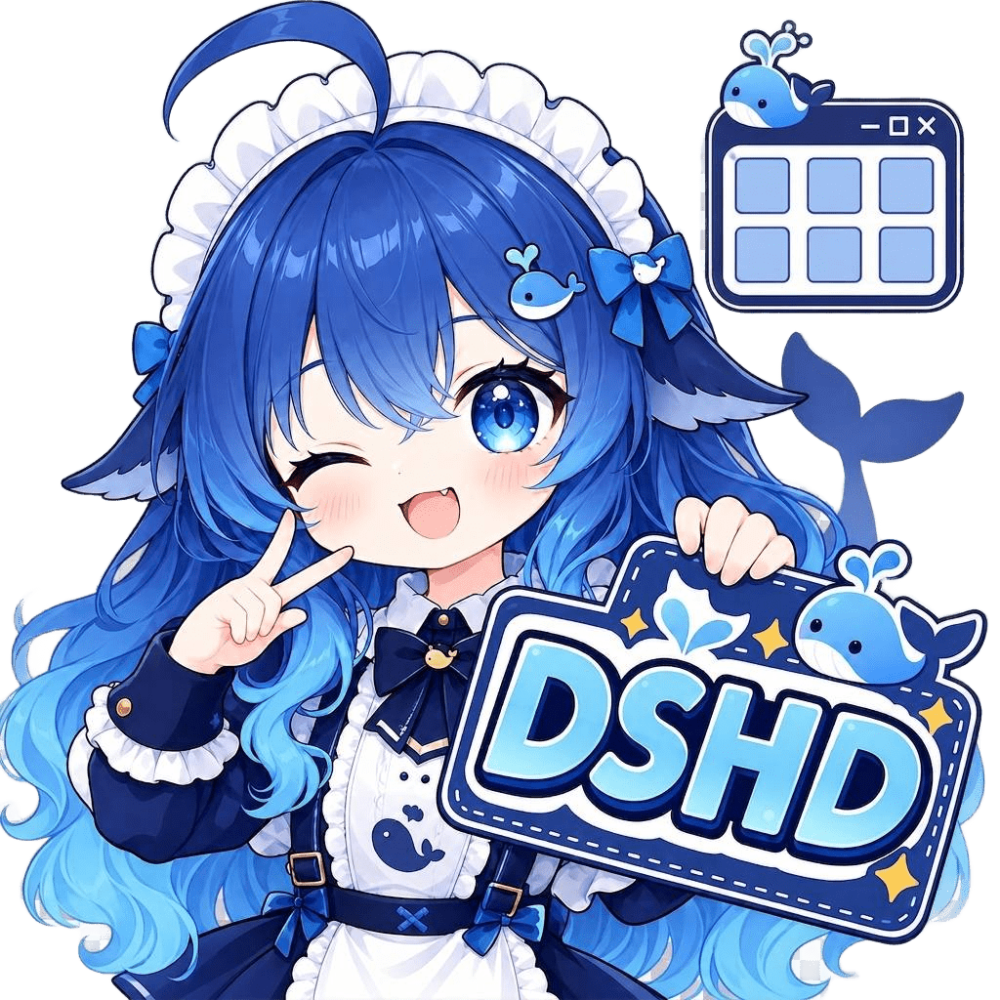
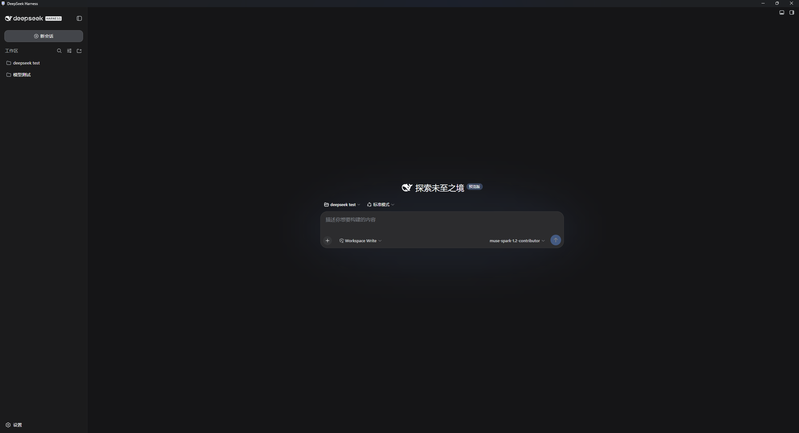
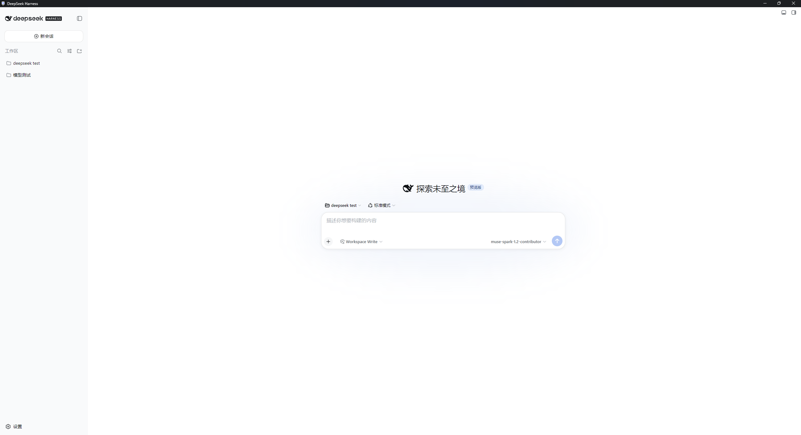
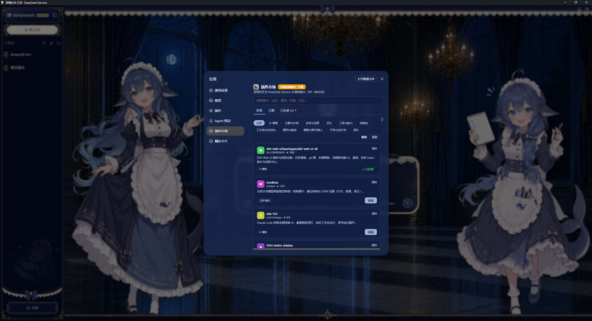

# dsh-desktop-shell

<p align="center"></p>

English | [中文](README.md)

Pure Electron shell for [DeepSeek Harness](https://github.com/deepseek-ai/deepseek-harness) (`dsh`). No bundled `dsh` code — the window only loads `http://127.0.0.1:3080`; the shell spawns `npx --yes @deepseek-ai/dsh@latest web` on launch, so official updates require no rebuild.

> Reference format: this README follows the package README contract in [`deepseek-harness/docs/cookbook/adding-a-package.md`](https://github.com/deepseek-ai/deepseek-harness/blob/main/docs/cookbook/adding-a-package.md#4-write-the-package-readme) and the prose rules in `docs/AGENTS.md`. The closest in-tree template is [`packages/core/tools/README.md`](https://github.com/deepseek-ai/deepseek-harness/blob/main/packages/core/tools/README.md) (the first spine plugin).

## Screenshots

Pure shell is transparent to plugins — windowed `dsh web` with community skins and market work unchanged.

| Dark | Light |
|---|---|
|  |  |

**Community skin** [`dsh-web-ui-all`](https://github.com/zhu1090093659/dsh-web-ui/tree/main/packages/dsh-web-ui-all) — loaded directly, no shell change:


**Plugin Market** [`dsh-market`](https://github.com/dsh-market/dsh-market#readme) — packaged shell has no effect on `dsh-plugin` ecosystem:



## Run

### Prerequisites

- `Node.js ^22.19 || >=24` (required by `dsh` itself; the shell also uses it to spawn `npx`)
- `pnpm@11.7.0` recommended, `npm`/`yarn` also work for the Electron project

### From release

Download `DSH Desktop Setup 0.1.1.exe` from Releases, install, then double-click `DSH Desktop`. The first launch pulls `@deepseek-ai/dsh@latest` via `npx` and opens the Harness Web UI.

### From source

```sh
git clone https://github.com/<you>/dsh-desktop-shell.git
cd dsh-desktop-shell/dsh-desktop-electron
pnpm install
pnpm start        # dev: open Electron against local npx dsh web
pnpm run build    # prod: electron-builder → dist/DSH Desktop Setup 0.1.1.exe (~80MB, Chromium included)
```

The shell does not require `deepseek-harness` to be cloned; `npx --yes @deepseek-ai/dsh@latest web` is the single source of truth (same contract as `npx @deepseek-ai/dsh web` in the [upstream README](https://github.com/deepseek-ai/deepseek-harness#run-from-npm)).

## Architecture

```
Electron main (main.js)
  ├─ spawnDsh() ──► cmd /c npx --yes @deepseek-ai/dsh@latest web   (stdio: ignore, windowsHide: true)
  ├─ waitForReady(http://127.0.0.1:3080, 15000ms) ── poll 500ms via http.get
  └─ BrowserWindow ──► data:text/html loading → http://127.0.0.1:3080 on success
                      fallback error page when not ready (hint: Node.js / manual npx)
  on window-all-closed → dshProc.kill() → app.quit() (except darwin)
```

- **Zero fork:** no vendored `dsh` code, no patch to `cordis.yml`, no plugin registration. The shell is transparent to every `dsh-plugin`.
- **Always latest:** `npx --yes` resolves `@latest` at each launch; pin by editing `main.js` (`@deepseek-ai/dsh@<version>`).
- **Single port contract:** `DSH_URL = http://127.0.0.1:3080` matches the upstream Web UI default. No custom `--host`/`--port` passthrough in v0.1.

## Project layout

```
dsh-desktop-shell/                 # ← this repo root (what you push to GitHub)
├─ dsh-desktop-electron/           # Electron pure-shell (the publishable artifact)
│  ├─ main.js                      # spawn + poll + BrowserWindow (66 lines)
│  ├─ package.json                 # private:true, electron 33 + electron-builder 25
│  ├─ build/icon.png               # window + installer icon
│  └─ dist/                        # ← ignored: builder output (exe, win-unpacked, blockmap)
├─ .pnpm-store/                    # ← ignored: local pnpm store cache (moved here to keep root clean)
├─ .gitignore                      # ignores node_modules / dist / .pnpm-store
└─ README.md (中文默认) / README.en.md / LICENSE
```

Only `dsh-desktop-electron/` source is needed to reproduce the build; `node_modules/` and `dist/` are never committed (pure version).

## Build

| Script | Action |
|---|---|
| `pnpm start` | `electron .` — launches shell with live `npx dsh web` |
| `pnpm run build` | `electron-builder --win --x64` — NSIS installer + unpacked dir in `dist/` |
| `pnpm run dist` | alias with `--publish never` |

`build.appId = com.dsh.desktop-shell`, `productName = DSH Desktop`, `win.target = nsis`, `icon = build/icon.png`. Porting to macOS/Linux is `electron-builder --mac/--linux` without code change.

## Configuration

No config file. Constants owned by `main.js`:

| Constant | Default | Meaning |
|---|---|---|
| `DSH_URL` | `http://127.0.0.1:3080` | Web UI to load |
| `waitForReady` timeout | `15000 ms` | poll deadline before fallback page |
| window size | `1280×800`, `min 900×600` | `center:true`, `autoHideMenuBar:true`, `backgroundColor:#111` |

Change requires editing `main.js` and rebuilding — intentional, to keep the shell dependency-free.

## Model Experience

None, as a standalone host shell.

The shell owns no prompt sections, tool schemas, or session events. Model-visible behavior is wholly owned by the spawned `dsh` process and its loaded plugins (e.g., `dsh-tools`, `dsh-system-prompt`).

#### KV Cache effect

No direct invalidation; the spawned Harness process owns any request-prefix changes.

## Known Limitations and Deferred Work

- **Fixed port:** only `127.0.0.1:3080`; custom `--host`/`--port`/`--trusted-host` passthrough is deferred until `dsh` exposes stable CLI flags for it.
- **Single instance:** no `requestSingleInstanceLock()`; double-clicking the exe spawns a second `npx dsh web` on the same port. Second launch will show the fallback page until the first exits.
- **No tray / auto-start:** `window-all-closed` kills `dshProc`; no background tray or OS autostart — add `tray` module when needed.
- **Poll-only readiness:** `http.get` polling with no WebSocket/port-ready signal; the 15 s window may be short on cold `npx` fetch.
- **Chromium weight:** NSIS exe ~81 MB because Electron bundles Chromium. A `PWA + .bat + msedge --app` variant is ~0 KB but needs Edge; `Tauri` pure-shell is ~5 MB but required Rust toolchain (attempted, `crates.io schannel` failure on this host).
- **Windows-first:** `cmd /c npx --yes @deepseek-ai/dsh@latest web` is Windows-tested; POSIX branch (`npx --yes @deepseek-ai/dsh@latest web`) is untested in this workspace.

## License

[MIT](LICENSE) — same as [deepseek-ai/deepseek-harness](https://github.com/deepseek-ai/deepseek-harness/blob/main/LICENSE).
Add topic `dsh-plugin` is not needed (not a Harness plugin); for discoverability consider `dsh` / `deepseek-harness` / `electron-shell`.
